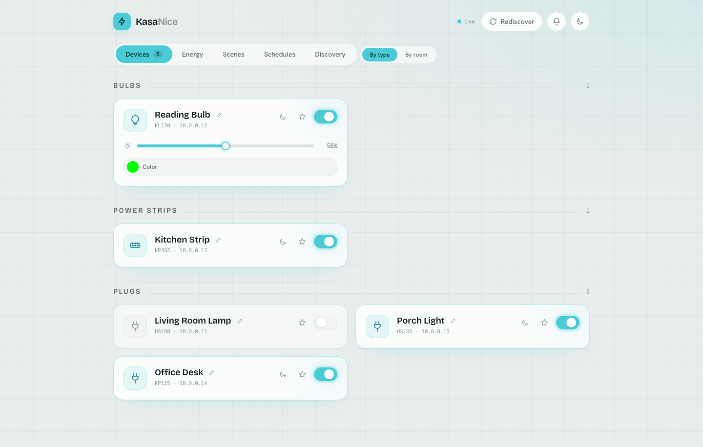
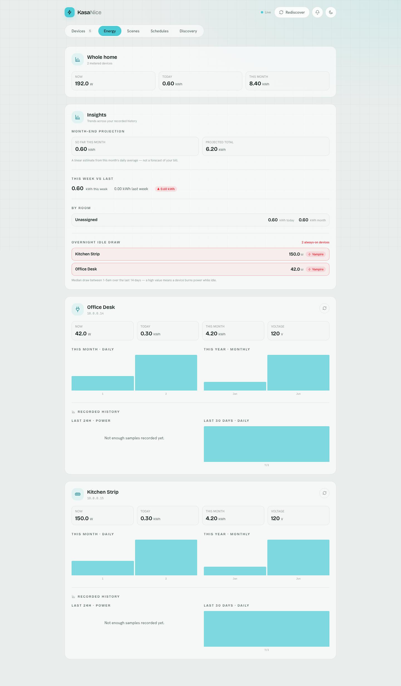

# Kasa-Nice

A modern, containerized web app for controlling TP-Link Kasa smart home devices
on your local network — no cloud account required.

A **FastAPI** backend ([`api/`](api/)) talks to your devices via
[python-kasa](https://github.com/python-kasa/python-kasa) and serves a
**SvelteKit** single-page frontend ([`web/`](web/)) that streams live state.

<p align="center">
  <picture>
    <source media="(prefers-color-scheme: dark)" srcset="docs/screenshots/devices-dark.png">
    
  </picture>
</p>
<p align="center">
  <picture>
    <source media="(prefers-color-scheme: dark)" srcset="docs/screenshots/energy-dark.png">
    
  </picture>
</p>

<sub>Screenshots are generated from seeded fake devices (no real hardware) —
regenerate with <code>just screenshots</code>.</sub>

## Features

- **Local control** — discover and control Kasa devices on your LAN, no cloud
- **Live state** — the UI streams device state over Server-Sent Events, so
  changes made elsewhere (the Kasa app, a physical switch) show up automatically
- **Full device support** — plugs, dimming, bulb color, and individual outlets
  on power strips
- **Rooms & favorites** — group devices into rooms and star the ones you reach
  for most
- **Scenes** — snapshot device states and re-apply them in one tap
- **Schedules** — server-side rules on fixed times, sunrise/sunset, or one-shot
  timers
- **Energy** — live power draw, daily/monthly charts, and server-side history
  retained beyond what each device remembers
- **Alerts** — offline/recovery and power-draw alerts, in-app and via an
  optional webhook
- **Vacation mode** — presence simulation that randomly lights an empty home
- **Persistent discovery** — devices added by IP survive restarts
- **Backup & restore** — all server state as one JSON download, plus the raw
  energy-history database
- **Light/dark theme** with an instant, no-flash toggle
- **Docker-ready** — one multi-stage image, one port

## Quick Start

### Docker (recommended)

```bash
git clone https://github.com/ryandavila/Kasa-Nice.git
cd Kasa-Nice
docker compose up -d
# open http://localhost:8080
```

> **Discovery & networking:** Docker's default bridge network can't carry the
> UDP broadcast discovery uses, so add devices by IP in the **Discovery** tab —
> or, on a Linux host, switch to host networking (see the commented
> `network_mode: host` in [`compose.yml`](compose.yml)). If your devices live on
> a separate subnet or VLAN, set `KASA_SCAN_SUBNET` and the server sweeps it by
> unicast instead.

### Local (without Docker)

```bash
git clone https://github.com/ryandavila/Kasa-Nice.git
cd Kasa-Nice
uv sync
just run          # builds the frontend, then serves it from the API at :8080
```

## API

All endpoints live under `/api`; the full interactive reference (every route,
schema, and example) is served at `http://localhost:8080/docs`. In brief:

| Area | Endpoints |
| --- | --- |
| Devices | list, live state, discover, power/brightness/color, per-outlet control, rename |
| Energy | per-device usage & recorded history, whole-home summary, derived insights |
| Live updates | `GET /api/events` (Server-Sent Events) |
| Rooms & favorites | room CRUD, per-room power, starred devices |
| Schedules & scenes | rule and scene CRUD, scene apply |
| Alerts | recent alerts, per-device power thresholds |
| Backup | full JSON backup/restore, energy-database snapshot |
| Vacation | presence-simulation config and live status |

## Configuration

| Variable | Default | Purpose |
| --- | --- | --- |
| `KASA_HOST` / `KASA_PORT` | `127.0.0.1` (`0.0.0.0` in Docker) / `8080` | Bind address and port |
| `KASA_*_FILE` | `data/…` | Per-store persistence paths: known devices, rooms, schedules, scenes, alert thresholds, vacation config, and the energy-history SQLite database |
| `TPLINK_USERNAME` / `TPLINK_PASSWORD` | _(unset)_ | TP-Link cloud credentials, required for newer SMART-protocol devices (e.g. KP125M) |
| `KASA_SCAN_SUBNET` | _(unset)_ | CIDR subnet swept by unicast on startup and from the Discovery tab |
| `KASA_CLOUD_FALLBACK` / `KASA_CLOUD_MODELS` / `KASA_CLOUD_POLL_INTERVAL` | `0` / `HS300` / `30` | Cloud control for devices that dropped local auth — see below |
| `KASA_ENERGY_RATE` / `KASA_ENERGY_CURRENCY` | _(unset)_ / `$` | Flat price per kWh (and symbol) for cost estimates — see below |
| `KASA_ENERGY_SAMPLE_INTERVAL` | `300` | Seconds between energy-history samples (min `10`) |
| `KASA_ALERT_INTERVAL` / `KASA_ALERT_WEBHOOK_URL` | `60` / _(unset)_ | Alert evaluation cadence and optional [ntfy](https://ntfy.sh)-compatible webhook |
| `KASA_LATITUDE` / `KASA_LONGITUDE` | _(unset)_ | Location (decimal degrees) for sunrise/sunset schedules |

Put credentials in a `.env` at the repo root (copy `.env.example`); the server
loads it on every start, with real environment variables taking precedence.
Without credentials, only legacy plugs are reachable. `.env` is gitignored.

### Cloud fallback

Some devices (notably the **HS300** strip) shipped firmware that
[removed the local auth python-kasa can speak](https://github.com/python-kasa/python-kasa/issues/1604).
Set `KASA_CLOUD_FALLBACK=1` and the server attaches them through TP-Link's cloud
after local discovery — they appear, toggle, and report energy like local
devices, just a little slower and refreshed every `KASA_CLOUD_POLL_INTERVAL`
seconds rather than every poll.

### Energy cost

Set `KASA_ENERGY_RATE` to show an estimated cost next to energy usage. It's a
**flat-rate approximation** — no tiered or time-of-use pricing, fees, or taxes —
so treat the figures as an estimate, not a bill. Unset, the UI shows kWh only.

### Idle draw & the "Vampire" tag

The Energy tab lists each device's **overnight idle draw** — the median power
between 1–5am over the last 14 days. A median above **15W** earns a red
**Vampire** tag: roughly 11 kWh a month burned while idle, enough to cost real
money, and above typical always-on gear like routers and aquarium pumps. The tag
can't tell intentional heavy loads from wasteful ones — treat it as a prompt to
check, not a verdict.

### Schedules

Rules fire at a **fixed time**, at **sunrise/sunset** with an offset (requires
`KASA_LATITUDE`/`KASA_LONGITUDE`), or **once** at a date & time; each switches a
device or room on/off or applies a scene. Rules run server-side once a minute
against the server's local time, so they fire with no browser open and tolerate
unreachable devices when fanning out across a room. Device cards also carry a
**"turn off in N minutes"** sleep timer, which posts a one-shot rule.

### Scenes

Save the current state of any set of devices — power, plus brightness and color
where supported — and re-apply it in one tap. Applying fans out concurrently and
tolerates per-device failure, reporting `{succeeded, failed}`.

### Alerts

A background task (every `KASA_ALERT_INTERVAL` seconds) watches for devices
dropping offline or recovering, and for power draw crossing a per-device
threshold set from the header **bell** dropdown. Alerts are debounced — one
incident, one alert. They appear in the bell (an in-memory buffer, not persisted
across restarts) and optionally POST to `KASA_ALERT_WEBHOOK_URL` in an
[ntfy](https://ntfy.sh)-compatible shape.

### Backup & restore

The **Settings** panel downloads everything the server persists as one versioned
JSON document, and restores it in two steps: a client-side summary of the file's
contents, then a confirmed upload the server re-validates whole — invalid
documents are rejected with no partial writes. The energy-history database is
separate (`GET /api/backup/energy.db`): a consistent SQLite snapshot for your
own archival, with no restore path.

### Vacation mode

Presence simulation: within a nightly window (fixed start time or sunset, until
a fixed end), the server randomly toggles a configured set of lights and rooms
with per-device jitter so an empty home looks lived-in, then turns everything
off when the window closes. If a light is changed from elsewhere — a schedule,
the Kasa app, a wall switch — the simulation adopts that state and backs off for
a cooldown rather than fighting it.

## Project Structure

```
├── api/                  # FastAPI backend
│   ├── main.py           # App factory, lifespan discovery, SPA serving
│   ├── routers/          # REST endpoints under /api, one module per domain
│   ├── kasa_service.py   # Device discovery & control
│   └── …                 # stores, scheduler, alerts, energy history, schemas
├── web/                  # SvelteKit frontend (Svelte 5, Tailwind v4, bun)
├── tests/                # pytest suite (python-kasa is faked; no devices needed)
├── Dockerfile            # Multi-stage: bun builds web/, Python serves it
└── compose.yml           # Docker Compose
```

## Development

Prerequisites: Python 3.14+, [uv](https://docs.astral.sh/uv/),
[bun](https://bun.sh/), [just](https://just.systems) (run `just` to list all
recipes), and optionally Docker.

```bash
just setup     # one-time: install Python + frontend deps
just dev       # API autoreload + frontend HMR in one terminal (http://localhost:5173)
just fix       # format, lint, typecheck, and test, fixing as it goes
just ci        # the same checks read-only — the exact suite CI enforces
```

The backend tests fake `python-kasa`, so they run with no devices or network.
To contribute: fork, branch, add tests where applicable, run `just ci`, and
open a pull request.

## Supported Devices

All devices supported by python-kasa, including:

- **Plugs:** HS100/103/105/107/110, KP105/115/125/401, EP10
- **Power strips:** EP40, HS300, KP303, KP200, KP400, KP405
- **Wall switches:** ES20M, HS200/210/220, KS200M/220M/230
- **Bulbs:** LB100/110/120/130/230, KL50/60/110/120/125/130/135
- **Light strips:** KL400/420/430

## Troubleshooting

**No devices found**
- Confirm devices are powered on and on the same network segment as the host.
- In Docker (bridge mode), broadcast discovery won't work — add devices by IP in
  the Discovery tab, or use host networking on Linux.
- Verify with python-kasa directly: `docker compose exec kasa-nice uv run kasa discover`.

**Permission issues**
- Ensure `./logs` and `./data` are writable by the container/user (both are
  mounted as volumes in Docker).

Logs go to the console and `./logs/kasa_nice.log` (rotated, 10 MB × 5).

## License

This project is licensed under the terms specified in the [LICENSE](LICENSE) file.

## Credits

A fork and modernization of the original
[Kasa-Nice](https://github.com/uni-byte/Kasa-Nice) by
[uni-byte](https://github.com/uni-byte), since rebuilt as a FastAPI + SvelteKit
application. Built on
[python-kasa](https://github.com/python-kasa/python-kasa),
[FastAPI](https://fastapi.tiangolo.com/),
[SvelteKit](https://svelte.dev/), and [Tailwind CSS](https://tailwindcss.com/).
